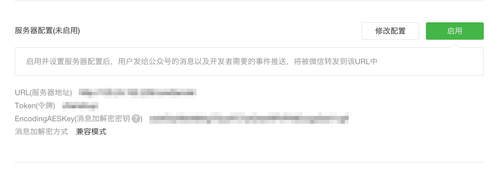
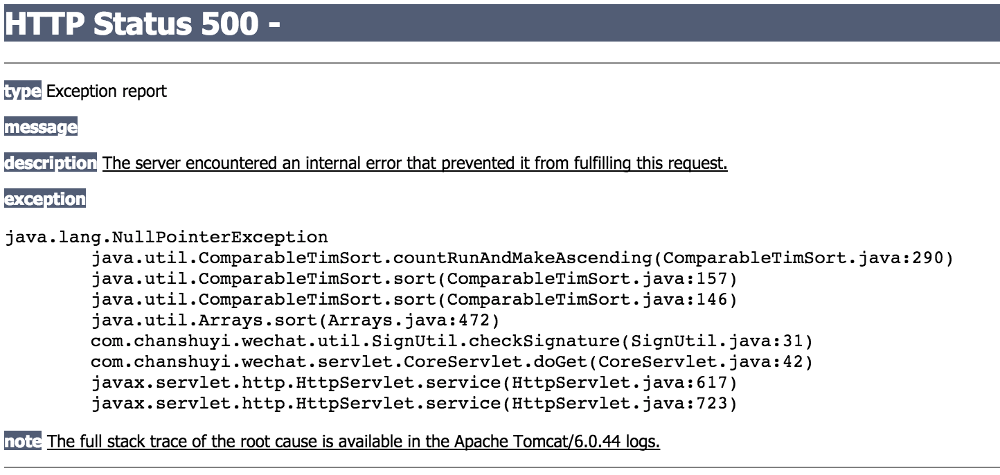
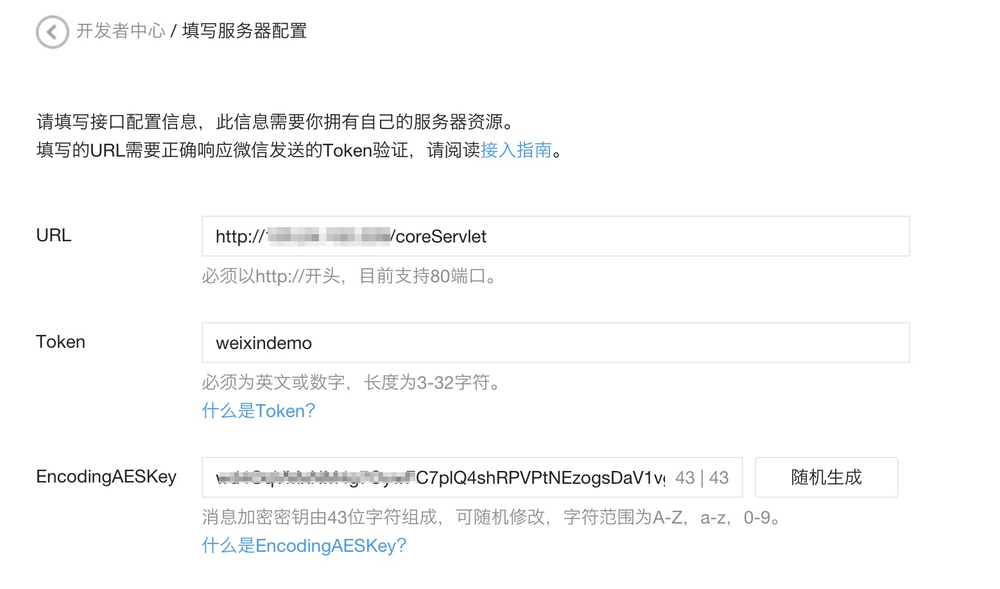

# 申请成为微信开发者

当你申请成为开发者的时候，微信官方会要求你填入以下信息`URL（服务器地址）、Token（令牌）、EncodingAESKey（消息加解密秘钥）`这3个信息，如下图所示：



这其实要求你的你的服务器上按其要求创建一个Web应用，以供其验证，用来确定这个服务器确实是归你所有。

下面我们创建公众账号后台验证接口。

创建一个Maven Web工程，这里我命名为weixindemo。导入所需的Jar包：

```xml
<?xml version="1.0" encoding="UTF-8"?>
<project xmlns="http://maven.apache.org/POM/4.0.0"
         xmlns:xsi="http://www.w3.org/2001/XMLSchema-instance"
         xsi:schemaLocation="http://maven.apache.org/POM/4.0.0 http://maven.apache.org/xsd/maven-4.0.0.xsd">
    <modelVersion>4.0.0</modelVersion>

    <groupId>com.chanshuyi.weixindemo</groupId>
    <artifactId>weixindemo</artifactId>
    <version>1.0-SNAPSHOT</version>

    <dependencies>
        <dependency>
            <groupId>javax.servlet</groupId>
            <artifactId>servlet-api</artifactId>
            <version>2.5</version>
            <scope>provided</scope>
        </dependency>
        <!-- Log4j日志 -->
        <dependency>
            <groupId>log4j</groupId>
            <artifactId>log4j</artifactId>
            <version>1.2.17</version>
        </dependency>
        <dependency>
            <groupId>org.slf4j</groupId>
            <artifactId>slf4j-log4j12</artifactId>
            <version>1.7.6</version>
        </dependency>
        <dependency>
            <groupId>org.slf4j</groupId>
            <artifactId>slf4j-api</artifactId>
            <version>1.7.6</version>
        </dependency>
    </dependencies>
    <build>
        <plugins>
            <plugin>
                <groupId>org.apache.tomcat.maven</groupId>
                <artifactId>tomcat7-maven-plugin</artifactId>
                <version>2.1</version>
                <configuration>
                    <port>80</port>
                    <path>/</path>
                    <uriEncoding>UTF-8</uriEncoding>
                    <finalName>weixindemo</finalName>
                    <server>tomcat7</server>
                </configuration>
            </plugin>
        </plugins>
    </build>
</project>
```

在resources文件夹下增加log4j.properties配置文件：

```
##设置级别和目的地
#log4j.rootLogger=debug,appender1,appender2
#
##输出到控制台
#log4j.appender.appender1.Encoding=UTF-8
#log4j.appender.appender1=org.apache.log4j.ConsoleAppender
#log4j.appender.appender1.layout=org.apache.log4j.PatternLayout
#log4j.appender.appender1.layout.ConversionPattern=[%d{yy/MM/dd HH:mm:ss:SSS}][%C-%M] %m%n
#
##输出到文件(这里默认为追加方式)
#log4j.appender.appender2.Encoding=UTF-8
#log4j.appender.appender2=org.apache.log4j.FileAppender
#log4j.appender.appender2.layout=org.apache.log4j.PatternLayout
#log4j.appender.appender2.layout.ConversionPattern=[%d{HH:mm:ss:SSS}][%C-%M] -%m%n


log4j.rootLogger=info,console,file

log4j.appender.console=org.apache.log4j.ConsoleAppender
log4j.appender.console.layout=org.apache.log4j.PatternLayout
log4j.appender.console.layout.ConversionPattern=[%-5p] %m%n

log4j.appender.file=org.apache.log4j.DailyRollingFileAppender
log4j.appender.file.DatePattern='-'yyyy-MM-dd
log4j.appender.file.File=/var/logs/csywechat.log
log4j.appender.file.Append=true
log4j.appender.file.layout=org.apache.log4j.PatternLayout
log4j.appender.file.layout.ConversionPattern=[%-5p] %d %37c %3x - %m%n
```

新建一个能够处理请求的Servlet，命名任意，我在这里将其命名为`com.chanshuyi.wechat.servlet.CoreServlet`，代码如下：

```java
package com.chanshuyi.wechat.servlet;

import com.chanshuyi.wechat.util.SignUtil;
import org.slf4j.Logger;
import org.slf4j.LoggerFactory;

import javax.servlet.ServletException;
import javax.servlet.http.HttpServlet;
import javax.servlet.http.HttpServletRequest;
import javax.servlet.http.HttpServletResponse;
import java.io.IOException;
import java.io.PrintWriter;

/**
 * 核心请求处理类
 *
 * @author chenyr
 * @date 2013-05-18
 */
public class CoreServlet extends HttpServlet {

    private static final long serialVersionUID = 4440739483644821986L;

    private Logger log = LoggerFactory.getLogger(CoreServlet.class);

    /**
     * 确认请求来自微信服务器
     * 用于修改公众号开发者配置，确认服务器的存在
     */
    public void doGet(HttpServletRequest request, HttpServletResponse response) throws ServletException, IOException {
        log.info("Receive a GET REQUEST from " + request.getRemoteAddr());
        // 微信加密签名
        String signature = request.getParameter("signature");
        // 时间戳
        String timestamp = request.getParameter("timestamp");
        // 随机数
        String nonce = request.getParameter("nonce");
        // 随机字符串
        String echostr = request.getParameter("echostr");

        PrintWriter out = response.getWriter();
        // 通过检验signature对请求进行校验，若校验成功则原样返回echostr，表示接入成功，否则接入失败
        if (SignUtil.checkSignature(signature, timestamp, nonce)) {
            out.print(echostr);
        }
        out.close();
        out = null;
        log.info("GET REQUEST handle is over.");
    }

    /**
     * 处理微信服务器发来的消息
     */
    public void doPost(HttpServletRequest request, HttpServletResponse response) throws ServletException, IOException {
        // TODO 消息的接收、处理、响应
    }
}
```

可以看到，代码中只完成了doGet方法，它的作用正是确认请求是否来自于微信服务器；而doPost方法不是我们这次要讲的内容，并且完成接口配置也不需要管doPost方法，就先空在那里。

在doGet方法中调用了`com.chanshuyi.wechat.util.SignUtil.checkSignature`方法，SignUtil.java的实现如下：

```java
package com.chanshuyi.wechat.util;

import org.slf4j.Logger;
import org.slf4j.LoggerFactory;

import java.security.MessageDigest;
import java.security.NoSuchAlgorithmException;
import java.util.Arrays;

/**
 * 请求校验工具类
 *
 * @author chenyr
 * @date 2015.10.03
 */
public class SignUtil {

    private static  Logger log = LoggerFactory.getLogger(SignUtil.class);

    // 与接口配置信息中的Token要一致
    private static String token = "weixindemo";

    /**
     * 验证签名
     *
     * @param signature
     * @param timestamp
     * @param nonce
     * @return
     */
    public static boolean checkSignature(String signature, String timestamp, String nonce) {
        log.info("Ready to check the Signature.");
        String[] arr = new String[] { token, timestamp, nonce };
        // 将token、timestamp、nonce三个参数进行字典序排序
        Arrays.sort(arr);
        StringBuilder content = new StringBuilder();
        for (int i = 0; i < arr.length; i++) {
            content.append(arr[i]);
        }
        MessageDigest md = null;
        String tmpStr = null;

        try {
            md = MessageDigest.getInstance("SHA-1");
            // 将三个参数字符串拼接成一个字符串进行sha1加密
            byte[] digest = md.digest(content.toString().getBytes());
            tmpStr = byteToStr(digest);
        } catch (NoSuchAlgorithmException e) {
            e.printStackTrace();
        }

        content = null;
        // 将sha1加密后的字符串可与signature对比，标识该请求来源于微信
        return tmpStr != null ? tmpStr.equals(signature.toUpperCase()) : false;
    }

    /**
     * 将字节数组转换为十六进制字符串
     *
     * @param byteArray
     * @return
     */
    private static String byteToStr(byte[] byteArray) {
        String strDigest = "";
        for (int i = 0; i < byteArray.length; i++) {
            strDigest += byteToHexStr(byteArray[i]);
        }
        return strDigest;
    }

    /**
     * 将字节转换为十六进制字符串
     *
     * @param mByte
     * @return
     */
    private static String byteToHexStr(byte mByte) {
        char[] Digit = { '0', '1', '2', '3', '4', '5', '6', '7', '8', '9', 'A', 'B', 'C', 'D', 'E', 'F' };
        char[] tempArr = new char[2];
        tempArr[0] = Digit[(mByte >>> 4) & 0X0F];
        tempArr[1] = Digit[mByte & 0X0F];

        String s = new String(tempArr);
        return s;
    }
}
```

这里唯一需要注意的就是SignUtil类中的成员变量token，这里赋予什么值，在接口配置信息中的Token就要填写什么值，两边保持一致即可，没有其他要求，建议用项目名称、公司名称缩写等，我在这里用的是项目名称`weixindemo`。

最后再来看一下web.xml中，CoreServlet是怎么配置的，web.xml中的配置代码如下：

```xml
<?xml version="1.0" encoding="UTF-8"?>
<web-app xmlns="http://xmlns.jcp.org/xml/ns/javaee"
         xmlns:xsi="http://www.w3.org/2001/XMLSchema-instance"
         xsi:schemaLocation="http://xmlns.jcp.org/xml/ns/javaee http://xmlns.jcp.org/xml/ns/javaee/web-app_3_1.xsd"
         version="3.1">
    <!-- 配置微信服务器验证的处理类 -->
    <servlet>
        <servlet-name>coreServlet</servlet-name>
        <servlet-class>
            com.chanshuyi.wechat.servlet.CoreServlet
        </servlet-class>
    </servlet>
    <servlet-mapping>
        <servlet-name>coreServlet</servlet-name>
        <url-pattern>/coreServlet</url-pattern>
    </servlet-mapping>
</web-app>
```

到这里，所有编码都完成了，就是这么简单。接下来就是将工程发布到公网服务器上，如果没有公网服务器环境，可以去了解下BAE、SAE或阿里云。发布到服务器上后，我们在浏览器里访问CoreServlet，如果看到如下界面就表示我们的代码没有问题：



啊，代码都报空指针异常了还说证明没问题？那当然了，因为直接在地址栏访问coreServlet，就相当于提交的是GET请求，而我们什么参数都没有传，在验证的时候当然会报空指针异常。

接下来，把coreServlet的访问路径拷贝下来，再回到微信公众平台的接入配置信息界面，将coreServlet的访问路径粘贴到URL中，并将SignUtil类中指定的token值weixinCourse填入到Token中，填写后的结果如下图所示：



之后点击提交，如果提示Token验证成功就是提交成功了。